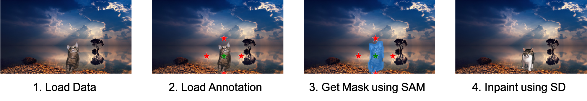

# A<sup>3</sup> (Augment Any Annotations): Inpaint Anything Meets Object Detection Annotation

<b>Nonpublished Technology</b>

TL; DR: This is a customised version of Inpaint Anything. Users can set annotation file and augment annotations by segmentation of SAM and inpainting of SD.  
So, `src` directory of this repo stores Inpaint Anythin.

Original Repos as below.

<p>
<a href="https://github.com/geekyutao/Inpaint-Anything">

 </a>
<a href="https://github.com/facebookresearch/segment-anything/">

</a>
<a href="https://github.com/CompVis/stable-diffusion/">

</p>
 

<p align="center">
  
</p>

 ## Installation

 Cloning files.
 
 ```bash
 git clone https://github.com/akh1r0ck/Augment-Any-Annotation.git
 cd Augment-Any-Annotation/src
 ```


 Details are on each original repos.

 ```bash
 conda create -n a3 python=3.9
 conda activate a3
 conda install pytorch torchvision torchaudio pytorch-cuda=11.8 -c pytorch -c nvidia
 pip install git+https://github.com/facebookresearch/segment-anything.git
 python -m pip install diffusers transformers accelerate scipy safetensors
 ```
 
 Download SAM model
 ```
 wget https://dl.fbaipublicfiles.com/segment_anything/sam_vit_h_4b8939.pth
 ```
 
### Verify the installation
 
 ```bash
 python a3_SingleImage_byCOCO.py \
        --dataset-desc animal \
        --sam-ckpt ./sam_vit_h_4b8939.pth \
        --annotation-path ./annotations.json
 ```
